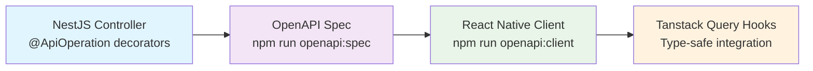

# LexiLearner Migration Overview

## Migration Context

We're migrating from a **working C# backend** to a **modern NestJS + Kysely stack** while maintaining a working application throughout the process.

### Current Architecture

- **Backend**: C# ASP.NET Core + Entity Framework + PostgreSQL
- **Frontend**: React Native with **manual fetch/axios calls** to C# endpoints
- **API Docs**: Manual Swagger maintenance

### Target Architecture

- **Backend**: NestJS + Kysely + PostgreSQL
- **Frontend**: React Native with **auto-generated client** + Tanstack Query
- **API Docs**: Auto-generated from NestJS Swagger decorators

## Code-First API Development Workflow

**The Goal**: Write NestJS code with decorators → Auto-generate spec → Auto-generate client → Always in sync!



### Automation Pipeline

1. **Write NestJS**: Add `@ApiOperation`, `@ApiResponse` decorators to controllers
2. **Generate Spec**: `npm run openapi:spec` extracts OpenAPI JSON from running NestJS server
3. **Generate Client**: `npm run openapi:client` creates type-safe React Native client with Tanstack Query hooks
4. **Import to Apidog**: Auto-import spec for team API testing and documentation
5. **Always in Sync**: No manual API maintenance required!

## Migration Strategy

### Vertical Full-Stack Implementation

- Migrate **complete features** one at a time (not layers)
- Each feature includes: C# analysis → NestJS implementation → Client generation → UI integration
- Maintain working application throughout migration
- Preserve C# backend as reference during development

### Feature Migration Order

1. **Authentication** (High Priority) - Core user auth, JWT, refresh tokens
2. **User Management** (High Priority) - Profiles, settings, roles
3. **Classroom Management** (High Priority) - CRUD operations, enrollment
4. **Minigames System** (Medium Priority) - Game logic, scoring, leaderboards
5. **Reading Materials** (Medium Priority) - Content management, assignments
6. **Reading Sessions** (Medium Priority) - Progress tracking, analytics
7. **Achievements** (Low Priority) - Badge system, rewards

## Repository Structure

### Monorepo Organization

```
lexilearner/
├── backend/              # NestJS target implementation (pnpm)
├── mobile/               # React Native app - Updated version (pnpm)
├── LexiLearner/          # Reference implementation
│   ├── lexilearner/      # Old mobile app version
│   └── server/           # C# backend reference
├── docs/                 # Migration documentation
├── scripts/              # OpenAPI automation
├── package.json          # Workspace configuration
├── pnpm-workspace.yaml   # pnpm monorepo configuration
└── pnpm-lock.yaml        # Unified dependency lock file
```

### Git Strategy

- **Include in repo**: `backend/`, `mobile/`, `docs/`, `scripts/`
- **Reference only**: `LexiLearner/` folder contains both old mobile and C# server for migration reference
- **Package Manager**: Entire monorepo uses **pnpm** for consistency and efficiency
- **Reason**: Unified dependency management with pnpm workspace

## Migration Progress

### ✅ Completed

- **Mobile App Update**: Replaced with latest version from LexiLearner/lexilearner
- **Package Manager Migration**: Entire monorepo migrated from npm to pnpm
- **Workspace Configuration**: pnpm workspace configured with pnpm-workspace.yaml
- **Repository Structure**: Organized with reference implementations in LexiLearner folder

### 🔄 In Progress

- **Backend Migration**: NestJS modules for Auth, Classrooms, Minigames
- **API Generation Pipeline**: OpenAPI spec → Client generation workflow

## Development Workflow

### Per Feature Development

1. **Analyze C# Implementation**

   - Study business logic in `csharp-backend/Controllers/`
   - Understand data flows and API patterns
   - Note security requirements and validation rules

2. **Implement NestJS Backend**

   - Create module in `backend/src/modules/`
   - Add Swagger decorators (@ApiOperation, @ApiResponse)
   - Implement with Kysely for optimized database queries
   - Write comprehensive tests

3. **Generate API Client**

   - Run `npm run openapi:spec` to extract spec from NestJS
   - Run `npm run openapi:client` to generate React Native client
   - Validate generated types and hooks

4. **Integrate with React Native**

   - Replace manual API calls with generated Tanstack Query hooks
   - Update Zustand stores to use new hooks
   - Test user workflows end-to-end

5. **Validate Feature Parity**
   - Compare functionality with C# version
   - Performance testing and optimization
   - Security validation

## Quality Assurance

### Testing Strategy

- **Unit Tests**: Jest for backend, React Native Testing Library for mobile
- **Integration Tests**: TestContainers with real PostgreSQL
- **E2E Tests**: Critical user journeys across full stack
- **Performance**: Load testing to meet/exceed C# backend
- **Security**: Automated vulnerability scanning

### Migration Validation

- **Side-by-side Testing**: Compare C# vs NestJS endpoint responses
- **Data Integrity**: Validate database operations
- **Feature Parity**: Ensure no functionality is lost
- **User Acceptance**: Test with real users/workflows

## Success Metrics

### Technical Metrics

- **API Response Time**: < 200ms for CRUD operations
- **Test Coverage**: > 90% backend, > 80% frontend
- **Type Safety**: 100% TypeScript strict mode compliance
- **Bundle Size**: No significant increase in mobile app size

### Development Experience

- **API Maintenance**: Zero manual API client updates
- **Developer Velocity**: Faster feature development with generated client
- **Documentation**: Always up-to-date API docs
- **Team Coordination**: Apidog integration for API testing

## Risk Mitigation

### High-Risk Areas

1. **Authentication/Security** - JWT implementation, token refresh
2. **Database Queries** - Kysely vs Entity Framework differences
3. **File Handling** - Avatar uploads, content storage
4. **Performance** - Query optimization, N+1 problem avoidance

### Mitigation Strategies

- **Gradual Rollout**: Feature flags for progressive enablement
- **Rollback Plan**: Keep C# backend deployable during migration
- **Monitoring**: Error rates, performance metrics, user feedback
- **Documentation**: Comprehensive migration documentation and knowledge transfer

---

_🎯 **Objective**: Modern TypeScript stack with automated API development workflow_
_📅 **Timeline**: Vertical feature migration maintaining working app_
_🚀 **Outcome**: Zero-maintenance API client with full type safety_
